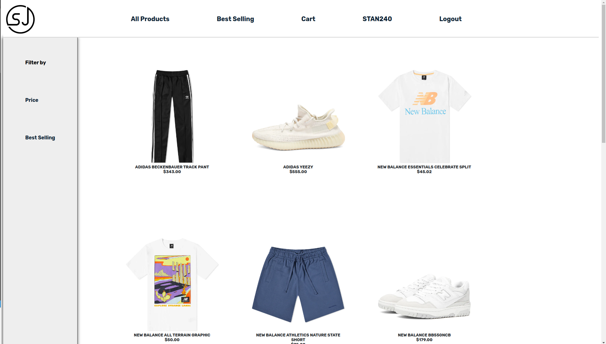
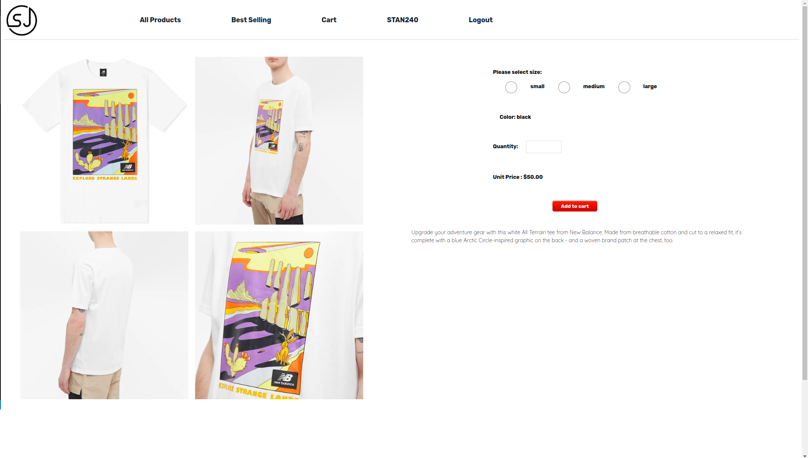
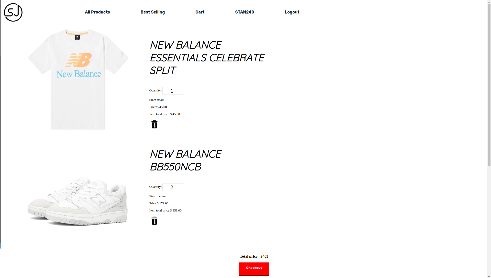
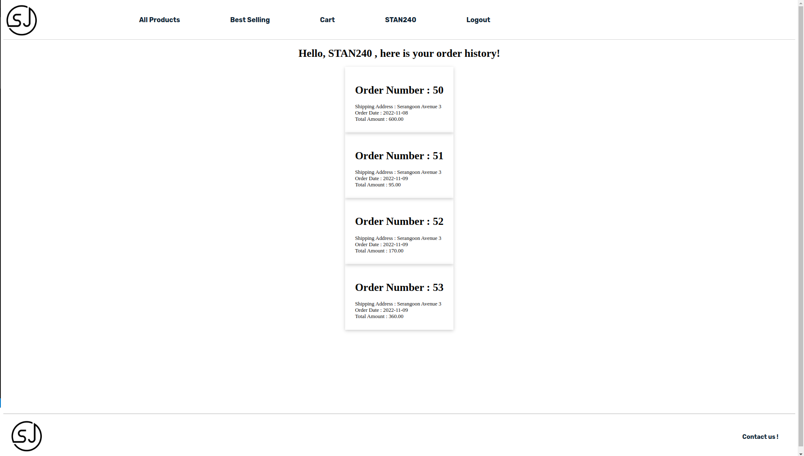
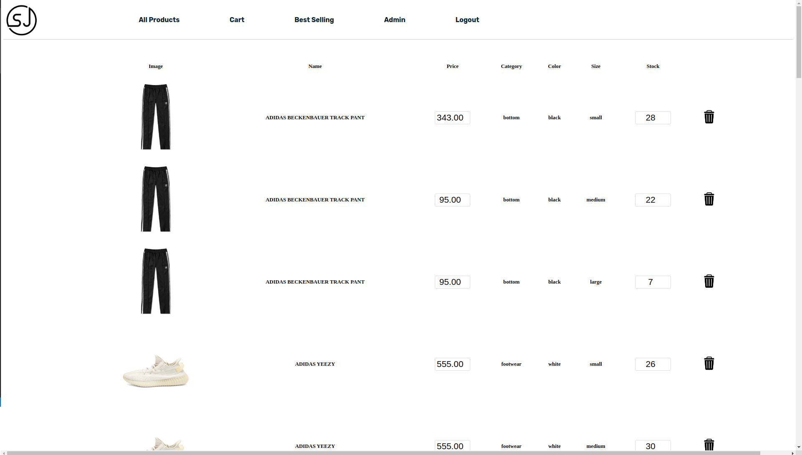

<!-- PROJECT LOGO -->
<br />
<div align="center">
  <a href="https://github.com/othneildrew/Best-README-Template">
    
  </a>

  <h3 align="center">An online shoe store</h3>

</div>

<!-- ABOUT THE PROJECT -->
## About The Project


The purpose of this project is to create a online shoe store with LAMP stack.

### 1. Full Catalogue page, with filtering


### 2. Each Item can have many options. 


### 3. Cart implemented using Sessions


### 4. User have its own account and able to check order history


### 5. If user is logged in as 'Admin', he will able to edit quantity and add new item



### Built With


* 
* 
* 
* 	
* 


### Installation

_Below is an example of how you can instruct your audience on installing and setting up your app. This template doesn't rely on any external dependencies or services._

1. Install XAMPP 

2. Clone the repo in the the htdocs folder of Xampp
   ```sh
   git clone git@github.com:Mushimush/sj-store.git
   ```
3. Start the XAMPP server
   ```sh
   sudo /opt/lampp/lampp start
   ```


<!-- CONTRIBUTING -->
## Contributing

Contributions are what make the open source community such an amazing place to learn, inspire, and create. Any contributions you make are **greatly appreciated**.

If you have a suggestion that would make this better, please fork the repo and create a pull request. You can also simply open an issue with the tag "enhancement".
Don't forget to give the project a star! Thanks again!

1. Fork the Project
2. Create your Feature Branch (`git checkout -b feature/AmazingFeature`)
3. Commit your Changes (`git commit -m 'Add some AmazingFeature'`)
4. Push to the Branch (`git push origin feature/AmazingFeature`)
5. Open a Pull Request


<!-- CONTACT -->
## Contact

Stanley - [Email](stanleytanyr@gmail.com)

Project Link: [https://github.com/Mushimush/sj-store](https://github.com/Mushimush/sj-store)


